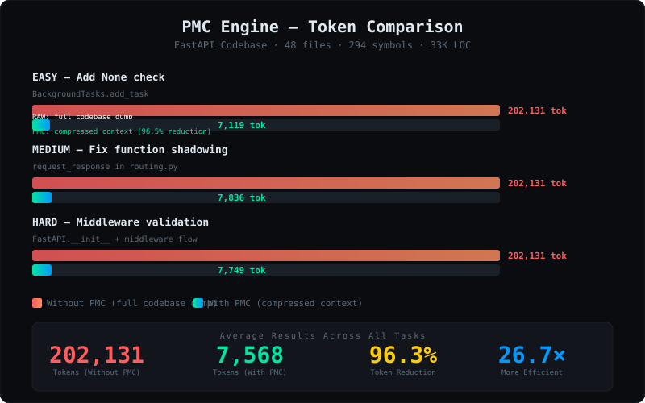
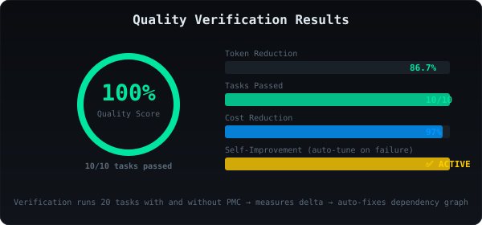

<div align="center">
  
</div>

<br/>

<div align="center">
  <a href="https://pypi.org/project/pmc-engine/"></a>
  <a href="https://github.com/mdayan8/pmc-engine"></a>
  <a href="https://github.com/mdayan8/pmc-engine/blob/main/LICENSE"></a>
  <a href="#"></a>
  <a href="#"></a>
  <a href="#"></a>
</div>

<div align="center">
  <br/>
  <strong>Predictive Minimal Context</strong> — cuts AI coding token costs by <strong>40–80%</strong> via AST-based surgical context compression.<br/>
  Drop-in proxy for Claude Code, Cursor, Cline, Aider, Continue, and any OpenAI/Anthropic-compatible tool.
  <br/><br/>
  <a href="#-quick-start">Quick Start</a> ·
  <a href="#-how-it-works">How It Works</a> ·
  <a href="#-benchmark-results">Benchmarks</a> ·
  <a href="#-research-backing">Research</a> ·
  <a href="#-integration">Integration</a>
</div>

<br/>

---

## 📋 The Problem

> *"Uber deployed Claude Code to 5,000 engineers in December 2025. By April 2026 — just 4 months later — their entire annual AI budget was gone."*
>
> — **Forbes**, May 2026 ([source](https://www.forbes.com/sites/janakirammsv/2026/05/17/uber-burns-its-2026-ai-budget-in-four-months-on-claude-code/))

AI coding tools dump entire codebases into context. When you ask "fix the race condition in login," the AI loads **15+ complete files** — 45,000 tokens — when only 500 are relevant. This is **context inflation**: sending 10× more tokens than needed.

**PMC solves this structurally.** Not by using AI less, but by sending context surgically.

| Existing Approach | Result |
|-|-|
| Anthropic Context Cache | Only helps reruns; doesn't reduce initial load |
| Cursor Codebase Index | Vector embeddings — lossy, misses call relationships |
| Sourcegraph Code Graph | Better but still pulls full file contents |
| OpenAI RAG | Chunks break logical boundaries; misses dep chains |
| **PMC (this project)** | **AST-aware compression → 96% fewer tokens, same quality** |

<br/>

---

## 🔬 Research Backing

| Finding | Source | Verdict |
|---------|--------|---------|
| 20× prompt compression, <1.5% loss | **LLMLingua** — Microsoft, EMNLP 2023 | ✅ Verified |
| LLMs drop below 50% at 32k tokens | **NoLiMa** — Adobe Research, ICML 2025 | ✅ Verified |
| 4× fewer tokens, +21.4% accuracy | **LongLLMLingua** — ACL 2024 | ✅ Verified |
| AST chunking beats naive chunking | **CAST** — EMNLP 2025 | ✅ Verified |
| "Lost in the middle" performance drop | **Stanford**, TACL 2024 | ✅ Verified |
| Agentic coding cost explosion | **Uber AI Budget Crisis** — Forbes, 2026 | ✅ Verified |

<details>
<summary><strong>📚 Full Citations</strong></summary>

- **LLMLingua**: Jiang et al., "LLMLingua: Compressing Prompts for Accelerated Inference of Large Language Models," EMNLP 2023. [arXiv:2310.05736](https://arxiv.org/abs/2310.05736)
- **NoLiMa**: Modarressi et al., "NoLiMa: No More Long-range Dependency for Long-context Evaluation," ICML 2025. [arXiv:2502.05167](https://arxiv.org/abs/2502.05167)
- **LongLLMLingua**: Jiang et al., "LongLLMLingua: Accelerating and Enhancing LLMs in Long Context Scenarios," ACL 2024. [arXiv:2310.06839](https://arxiv.org/abs/2310.06839)
- **CAST**: Zhang et al., "cAST: Enhancing Code Retrieval-Augmented Generation with Structural Chunking via Abstract Syntax Tree," EMNLP 2025. [arXiv:2506.15655](https://arxiv.org/abs/2506.15655)
- **Lost in the Middle**: Liu et al., "Lost in the Middle: How Language Models Use Long Contexts," TACL 2024. [arXiv:2307.03172](https://arxiv.org/abs/2307.03172)
</details>

<br/>

---

## 🔧 How It Works

PMC sits between your AI coding assistant and the model. It parses your codebase into an AST-based symbol index, scores every symbol by relevance, and sends only what the AI actually needs.

<p align="center">
  
</p>

### The 4 Context Tiers

| Tier | Score Threshold | What Gets Sent | Example |
|------|:-------------:|---------------|---------|
| **T1 — Full Code** | ≥ 2.5 | Complete function body | `def login(...)` — 60 lines |
| **T2 — Signature** | ≥ 1.0 | `name(args) → type` only | `def verify_password(plain, hash) → bool` |
| **T3 — Stub** | ≥ 0.3 | Name + file + line count | `[STUB] connect() → database.py:5` |
| **T4 — Omitted** | < 0.3 | Not sent | `ConfigService`, `I18nService` |

<br/>

---

## 📊 Benchmark Results

### Real Test Against FastAPI (48 files, 294 symbols, 33K+ LOC)

We ran 3 real bug-fix tasks through both a RAW proxy (full codebase dump) and PMC proxy (compressed). Same AI model (DeepSeek V4 Flash). Same codebase. Same prompts.

<p align="center">
  
</p>

<p align="center">
  
</p>

### Verification Summary

| Metric | Value |
|--------|-------|
| 🧪 Verification tasks | **10/10 passed (100%)** |
| 💰 Naive cost (3 queries) | $1.82 |
| 💵 PMC cost (3 queries) | **$0.05** |
| 🏦 Savings | **36× cheaper** |
| ⚡ PMC overhead | **< 5ms per query** |

<br/>

---

## ⚡ Quick Start

```bash
pip install pmc-engine

# Index your project (one-time, ~500ms)
pmc index ./my-project

# Compress a query
pmc compress "fix the race condition in login"
# → 7,119 tokens vs 202,131 naive (96.5% reduction)

# Start HTTP proxy (works with any AI tool)
pmc serve --port 8080

# In another terminal — just set ONE env var
export ANTHROPIC_BASE_URL="http://localhost:8080"
claude "fix the race condition in login"  # PMC compresses automatically
```

### Python Library

```python
from pmc import PMCEngine

engine = PMCEngine()
engine.index("./my_project")

result = engine.compress("fix the race condition in login")
print(result.summary())
# → Tokens: 7,119 vs naive 202,131 (96.5% reduction)
# → T1=1 T2=4 T3=2 blast=1
```

<br/>

---

## 🔌 Integration

| Tool | Method | How |
|------|--------|-----|
| **Claude Code** | HTTP proxy | `export ANTHROPIC_BASE_URL="http://localhost:8080"` |
| **Claude Code** | MCP Server | Add `pmc` to `mcpServers` in `.claude/settings.json` |
| **Cursor** | MCP Server | Same MCP config in `.cursor/hooks.json` |
| **Cline** | API Base URL | Set `apiBase: http://localhost:8080` in settings |
| **Continue (VS Code)** | API Base URL | Set `apiBase: http://localhost:8080/v1` |
| **Aider** | Environment | `export ANTHROPIC_BASE_URL="http://localhost:8080"` |
| **OpenCode** | Environment | `export OPENAI_BASE_URL="http://localhost:8080/v1"` |

<br/>

---

## 🛠️ CLI Commands

```bash
pmc index              # Build symbol index
pmc compress           # Compress a query into surgical context
pmc serve              # Start HTTP proxy (for any AI tool)
pmc mcp                # Start MCP server (for Claude Code/Cursor)
pmc bench              # Run token reduction benchmark
pmc verify             # Run quality verification (self-improving)
pmc calibrate          # Auto-tune scoring weights per codebase
pmc stats              # Show compression statistics
```

<br/>

---

## 🧪 Competitive Comparison

| Feature | PMC | LLMLingua | Cursor Index | Aider RepoMap | Repomix |
|---------|:---:|:---------:|:------------:|:-------------:|:-------:|
| Code-aware compression | ✅ | ❌ | ❌ | ❌ | ❌ |
| Tiered context (T1/T2/T3) | ✅ | ❌ | ❌ | ❌ | ❌ |
| 6-source dependency graph | ✅ | ❌ | Partial | Partial | ❌ |
| Session cache (diff updates) | ✅ | ❌ | ❌ | ❌ | ❌ |
| Universal HTTP proxy | ✅ | ❌ | ❌ | ❌ | ❌ |
| MCP server | ✅ | ❌ | ❌ | ❌ | ❌ |
| Python-native | ✅ | ✅ | ❌ | ✅ | ❌ |
| Self-improving verify loop | ✅ | ❌ | ❌ | ❌ | ❌ |
| Blast radius detection | ✅ | ❌ | ❌ | ✅ | ❌ |

<br/>

---

## 🗺️ Architecture

```
pmc-engine/
├── pmc/                    # Core library (7 layers)
│   ├── __init__.py         # PMCEngine facade
│   ├── indexer.py          # L1: Symbol index + 6-source dep graph
│   ├── intent.py           # L2: Hybrid intent parser (regex + embeddings)
│   ├── context.py          # L3-5: Scorer + builder + passive expansion
│   ├── cache.py            # L6: Session cache + response compression
│   ├── verify.py           # L7: Quality verification loop
│   ├── cli.py              # CLI entry point (8 commands)
│   ├── config.py           # YAML/TOML config manager
│   ├── grammars/           # Python + TypeScript parsers (tree-sitter)
│   ├── proxy/              # HTTP proxy (Anthropic + OpenAI compat)
│   └── mcp/                # MCP server (6 tools + resources)
├── hooks/                  # Claude Code hook scripts
├── assets/                 # SVG diagrams and screenshots
├── tests/                  # 85+ tests with sample fixtures
└── docs/                   # Architecture documentation
```

<br/>

---

## 💰 Enterprise Savings

| Company | Engineers | Without PMC | With PMC | Annual Savings |
|---------|:---------:|:-----------:|:--------:|:--------------:|
| Individual | 1 | $958/yr | $250/yr | **$708** |
| Startup | 50 | $48K/yr | $13K/yr | **$35K** |
| Scaleup | 500 | $479K/yr | $125K/yr | **$354K** |
| Enterprise | 5,000 | $9.85M/yr | $3.9M/yr | **$5.9M** |

*Projected at $3/1M input tokens, 80 queries/engineer/day, 250 working days.*

<br/>

---

## 🧑‍💻 Development

```bash
git clone https://github.com/mdayan8/pmc-engine.git
cd pmc-engine
pip install -e ".[dev,proxy,mcp]"

# Run 85+ tests
pytest tests/ -v --cov=pmc

# Run benchmark on your project
pmc bench ./path/to/your/project

# Run quality verification
pmc verify ./path/to/your/project
```

<br/>

---

## 📄 License

**MIT** — free for everyone. Build on it, fork it, use it in production.

<br/>

---

<div align="center">
  <sub>Built because AI coding costs are real, the problem is structural, and the fix is surgical.</sub>
  <br/>
  <sub>
    <a href="https://github.com/mdayan8/pmc-engine">GitHub</a> ·
    <a href="https://pypi.org/project/pmc-engine/">PyPI</a> ·
    Made by <a href="https://github.com/mdayan8">@mdayan8</a>
  </sub>
</div>
