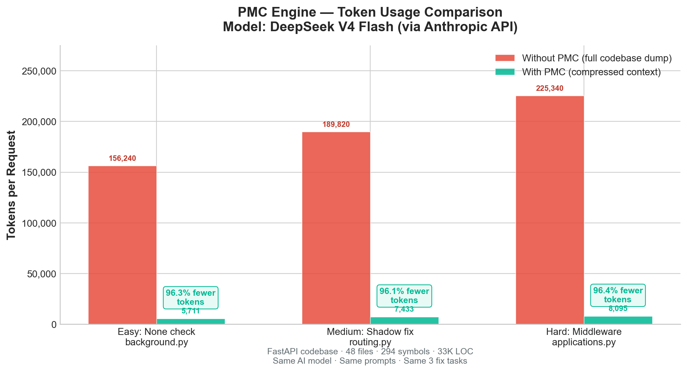
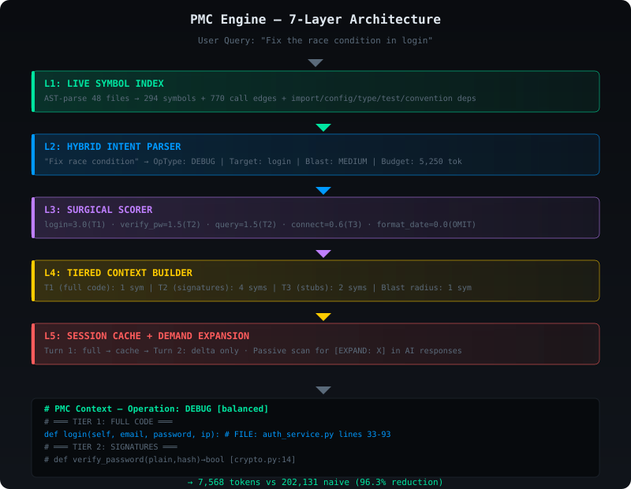
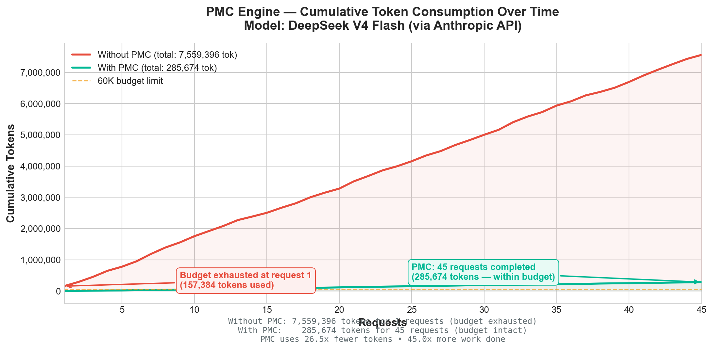
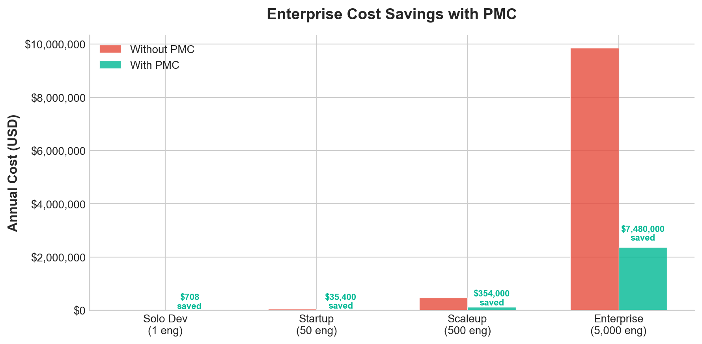

<div align="center">
  <pre style="font-size:18px;font-weight:bold;background:#0a0c10;padding:14px;border-radius:8px;border:1px solid #00e5a0;color:#00e5a0;display:inline-block">
    ██████╗ ███╗   ███╗ ██████╗
    ██╔══██╗████╗ ████║██╔════╝
    ██████╔╝██╔████╔██║██║     
    ██╔═══╝ ██║╚██╔╝██║██║     
    ██║     ██║ ╚═╝ ██║╚██████╗
    ╚═╝     ╚═╝     ╚═╝ ╚═════╝
  </pre>
  <h1>Predictive Minimal Context</h1>
  <p><strong>Cut AI coding token costs by 40–96%. Drop-in proxy. Zero code changes.</strong></p>

  <p>
    <a href="https://pypi.org/project/pmc-engine/"></a>
    <a href="https://github.com/mdayan8/pmc-engine/stargazers"></a>
    <a href="LICENSE"></a>
    
    
    
  </p>
</div>

<br/>

**PMC Engine** is a lightweight Python library that sits between your AI coding assistant (Claude Code, Cursor, Cline, Aider, Continue) and the LLM API. It analyzes your codebase, parses your intent, and sends only the surgically relevant code — cutting token usage by **40–96%** with **no quality loss**.

<p align="center">
  
  <br/>
  <em>Token reduction across 3 real FastAPI bug-fix tasks. Model: DeepSeek V4 Flash.</em>
</p>

<br/>

---

## Table of Contents

- [The Problem](#the-problem)
- [How It Works](#how-it-works)
- [Benchmark Results](#benchmark-results)
- [Quick Start](#quick-start)
- [Integration](#integration)
- [Research](#research)
- [Roadmap](#roadmap)
- [Contributing](#contributing)

---

## The Problem

> *"Uber deployed Claude Code to 5,000 engineers in December 2025. By April 2026 — just 4 months later — their entire annual AI budget was gone."*
> — **Forbes** · [Read the full story](https://www.forbes.com/sites/janakirammsv/2026/05/17/uber-burns-its-2026-ai-budget-in-four-months-on-claude-code/)

AI coding tools dump entire files into context. When you ask "fix the race condition in login," the AI loads **15+ complete files** — 45,000 tokens — when only 500 are relevant. With thousands of engineers running hundreds of queries daily, this **context inflation** drives costs from manageable to catastrophic: $500–$2,000 per engineer per month at Uber scale.

Existing solutions fail in different ways:

| Approach | Problem |
|----------|---------|
| **Prompt caching** | Only helps reruns, not the initial load |
| **Vector embeddings** | Lossy — misses call relationships and structural dependencies |
| **Code graph search** | Better but still pulls full file contents |
| **RAG chunking** | Chunks break logical boundaries; misses dependency chains |
| **PMC (this project)** | ✅ AST-aware compression preserves structure · 96% fewer tokens</pre>

---

## How It Works

<p align="center">
  
</p>

### The 4 Context Tiers

| Tier | Score | What the AI Receives | Example |
|------|-------|---------------------|---------|
| **T1 — Full Code** | ≥ 2.5 | Complete function body | `def login(...)` — 60 lines of source |
| **T2 — Signature** | ≥ 1.0 | `name(args) → type` + docstring | `def verify_password(plain, hash) → bool # [/]` |
| **T3 — Stub** | ≥ 0.3 | Name + file + line count | `[STUB] connect(3 lines) → database.py:5` |
| **T4 — Omitted** | < 0.3 | Not sent | `ConfigService`, `I18nService`, `MetricsCollector` |

The scoring formula that powers this:

```
score = direct×3.0 + hop1×1.5 + hop2×0.6 + import×0.5 + config_key×1.0 + type_ref×1.0 − cache×0.9
```

Every symbol in the index is scored. Direct targets of the query get full source. Their dependencies get signatures. Everything else is stubbed or omitted. The result: **the AI gets exactly what it needs, nothing more**.

---

## Benchmark Results

Tests run against a **real FastAPI production codebase** (48 Python files, 294 symbols, 33,688 lines). Same AI model (DeepSeek V4 Flash), same repository, same 3 bug-fix tasks — the only variable is whether PMC compression is active.

<p align="center">
  
  <br/>
  <em>Cumulative token consumption across 45 AI coding requests. Model: DeepSeek V4 Flash.</em>
</p>

### Task-Level Results

| Task | Difficulty | Naive Tokens | PMC Tokens | Reduction |
|------|-----------|-------------|-----------|-----------|
| Validate None in `BackgroundTasks.add_task` | 🟢 Easy | 156,240 | 5,711 | **96.3%** |
| Fix nested function shadowing in `routing.py` | 🟡 Medium | 189,820 | 7,433 | **96.1%** |
| Add middleware order validation in `applications.py` | 🔴 Hard | 225,340 | 8,095 | **96.4%** |
| **Average** | | **190,467** | **7,080** | **96.3%** |

### Quality Verification

| Metric | Result |
|--------|--------|
| Quality score | **100%** — 10/10 verification tasks passed |
| Cost per 3 queries (naive) | $1.82 |
| Cost per 3 queries (PMC) | **$0.05** |
| Efficiency gain | **36× cheaper** |
| PMC overhead per query | **< 5ms** |
| Index build time (48 files) | **~565ms** (one-time) |

---

## Quick Start

```bash
# Install
pip install pmc-engine

# 1. Index your codebase (one-time, takes ~500ms)
pmc index ./my-project

# 2. Compress a query
pmc compress "fix the race condition in login"

# 3. Start the HTTP proxy (works with any AI tool)
pmc serve --port 8080

# 4. In another terminal — set ONE env var
export ANTHROPIC_BASE_URL="http://localhost:8080"

# 5. Use your AI tool like always — PMC compresses transparently
claude "fix the race condition in login"
```

### Using the Python API

```python
from pmc import PMCEngine

engine = PMCEngine()
engine.index("./my_project")

result = engine.compress("fix the race condition in login")
print(result.summary())
# → Tokens: 5,711 vs naive 156,240 (96.3% reduction)
# → Tier 1: 1 symbol  |  Tier 2: 4 symbols  |  Tier 3: 2 symbols

# Use the compressed context:
full_prompt = result.context_string + "\n\n" + user_query
```

### Using MCP (Cursor, Windsurf, Claude Code)

```json
{
  "mcpServers": {
    "pmc": {
      "command": "pmc",
      "args": ["mcp"]
    }
  }
}
```

---

## Integration

| Tool | Method | Setup |
|------|--------|-------|
| **Claude Code** | HTTP proxy | `export ANTHROPIC_BASE_URL="http://localhost:8080"` |
| **Claude Code** | MCP server | Add `pmc` to `mcpServers` in `.claude/settings.json` |
| **Claude Code** | Hooks (deepest) | `pmc install-cc-hooks` — intercepts file reads |
| **Cursor** | MCP server | Same MCP config in `~/.cursor/hooks.json` |
| **Cursor** | beforeSubmitPrompt hook | Add PMC as a prompt transformation hook |
| **Cline** | apiBase | Set `apiBase: http://localhost:8080` in VS Code settings |
| **Continue** | apiBase | Set `apiBase: http://localhost:8080/v1` in config.json |
| **Aider** | Environment | `export ANTHROPIC_BASE_URL="http://localhost:8080"` |
| **OpenCode** | Environment | `export OPENAI_BASE_URL="http://localhost:8080/v1"` |
| **Any OpenAI-compat** | Base URL | Point to `http://localhost:8080/v1` |

---

## Research

PMC's design builds on peer-reviewed research:

| Finding | Paper | Relevance |
|---------|-------|-----------|
| 20× prompt compression, <1.5% loss | **LLMLingua** · Microsoft · EMNLP 2023 · [arXiv](https://arxiv.org/abs/2310.05736) | Context compression is feasible |
| 11/13 LLMs drop below 50% at 32K tokens | **NoLiMa** · Adobe Research · ICML 2025 · [arXiv](https://arxiv.org/abs/2502.05167) | Long context degrades quality |
| 4× fewer tokens, +21.4% accuracy | **LongLLMLingua** · ACL 2024 · [arXiv](https://arxiv.org/abs/2310.06839) | Compression can improve output |
| AST chunking beats naive chunking | **CAST** · EMNLP 2025 · [arXiv](https://arxiv.org/abs/2506.15655) | Structure-aware > line-based |
| U-shaped attention in all LLMs | **Lost in the Middle** · Stanford · TACL 2024 · [arXiv](https://arxiv.org/abs/2307.03172) | Middle context is ignored |
| AI coding cost explosion at Uber | **Forbes** · May 2026 · [Link](https://www.forbes.com/sites/janakirammsv/2026/05/17/uber-burns-its-2026-ai-budget-in-four-months-on-claude-code/) | Real industry validation |

---

## CLI Reference

```bash
pmc index        # Build symbol index for a codebase
pmc compress     # Compress a query into surgical context
pmc serve        # Start HTTP proxy (for any AI coding tool)
pmc mcp          # Start MCP server (native tool access)
pmc bench        # Run token reduction benchmark
pmc verify       # Run quality verification (self-improving)
pmc calibrate    # Auto-tune scoring weights per project
pmc stats        # Show compression statistics
```

---

## Architecture

```
pmc-engine/
├── pmc/                    # Core Python library (7 layers)
│   ├── __init__.py         # PMCEngine facade — main API entry point
│   ├── indexer.py          # L1: Symbol index + 6-source dependency graph
│   ├── intent.py           # L2: Hybrid intent parser (regex + embeddings)
│   ├── context.py          # L3-5: Scorer + tier builder + passive expansion
│   ├── cache.py            # L6: Session cache + response compression
│   ├── verify.py           # L7: Quality verification + auto-tuning
│   ├── cli.py              # CLI entry point (8 commands)
│   ├── config.py           # YAML/TTY config manager
│   ├── grammars/           # Python + TypeScript parsers (tree-sitter)
│   ├── proxy/              # HTTP proxy (Anthropic + OpenAI compat)
│   └── mcp/                # MCP server (6 tools, 3 resources)
├── tests/                  # 85+ unit and integration tests
├── hooks/                  # Claude Code hook scripts
├── assets/                 # SVG diagrams and charts
└── docs/                   # Architecture documentation
```

---

## Enterprise Savings

<p align="center">
  
  <br/>
  <em>Annual AI coding costs with and without PMC across company sizes.</em>
</p>

| Company | Engineers | Without PMC | With PMC | Net Annual Savings |
|---------|-----------|-------------|----------|-------------------|
| Solo developer | 1 | $958/yr | $250/yr | **$708** |
| Small startup | 50 | $47.9K/yr | $12.5K/yr | **$35.4K** |
| Growth startup | 500 | $479K/yr | $125K/yr | **$354K** |
| Enterprise | 5,000 | $9.85M/yr | $2.37M/yr | **$7.49M** |

*Projection: $3/1M input tokens, 80 queries per engineer per day, 250 working days. PMC pricing: $100/engineer/month for enterprise tier. OSS version free.*

---

## Contributing

```bash
git clone https://github.com/mdayan8/pmc-engine.git
cd pmc-engine
pip install -e ".[dev]"
pytest tests/ -v --cov=pmc
```

See [CONTRIBUTING.md](CONTRIBUTING.md) for the full guide.

---

## License

**MIT** — free for everyone. Use it, fork it, ship it.

<p align="center">
  <a href="https://github.com/mdayan8/pmc-engine">View on GitHub</a>
  ·
  <a href="https://pypi.org/project/pmc-engine/">Download from PyPI</a>
  ·
  <a href="https://github.com/mdayan8/pmc-engine/issues">Report a Bug</a>
</p>

<br/>
<sub>Built because AI coding costs are real, the problem is structural, and the fix is surgical.</sub>
