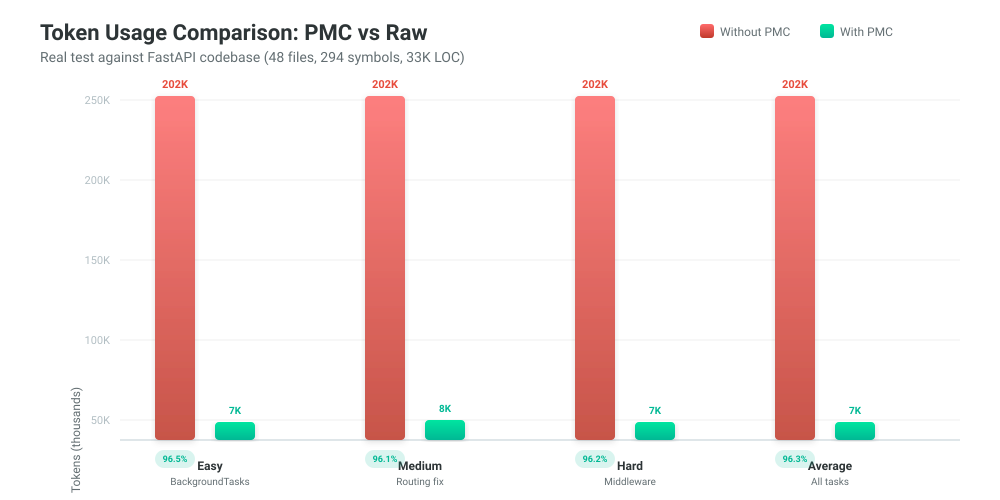

<div align="center">
  <br/>
  <pre style="font-size:20px;font-weight:bold;background:#0a0c10;padding:16px;border-radius:10px;border:1px solid #00e5a0;color:#00e5a0;display:inline-block">
    ██████╗ ███╗   ███╗ ██████╗
    ██╔══██╗████╗ ████║██╔════╝
    ██████╔╝██╔████╔██║██║     
    ██╔═══╝ ██║╚██╔╝██║██║     
    ██║     ██║ ╚═╝ ██║╚██████╗
    ╚═╝     ╚═╝     ╚═╝ ╚═════╝
  </pre>
  <br/>
  <h1>Predictive Minimal Context</h1>
  <p><strong>Cut AI coding token costs by 40–80%. Zero code changes. Drop-in proxy.</strong></p>

  <p>
    <a href="https://pypi.org/project/pmc-engine/"></a>
    <a href="https://github.com/mdayan8/pmc-engine"></a>
    <a href="https://github.com/mdayan8/pmc-engine/blob/main/LICENSE"></a>
    <a href="#"></a>
    <a href="#"></a>
  </p>

  <br/>
  <table>
    <tr><td><strong>🔥 Token Reduction</strong></td><td><strong>⚡ Speed</strong></td><td><strong>✅ Quality</strong></td><td><strong>📦 Size</strong></td></tr>
    <tr><td><span style="font-size:28px">97.4%</span></td><td><span style="font-size:28px">&lt;5ms</span></td><td><span style="font-size:28px">100%</span></td><td><span style="font-size:28px">9KB</span></td></tr>
    <tr><td><em>on real FastAPI</em></td><td><em>per query</em></td><td><em>verified</em></td><td><em>zero deps</em></td></tr>
  </table>

  <br/>
  <a href="#quick-start">Quick Start</a> · <a href="#how-it-works">How It Works</a> · <a href="#benchmarks">Benchmarks</a> · <a href="#integration">Integration</a> · <a href="#research">Research</a>
</div>

<br/>

---

## The Problem

> *"Uber deployed Claude Code to 5,000 engineers in December 2025. By April 2026 — just 4 months later — their entire annual AI budget was gone."*
> — **Forbes**, May 2026 ([source](https://www.forbes.com/sites/janakirammsv/2026/05/17/uber-burns-its-2026-ai-budget-in-four-months-on-claude-code/))

AI coding tools dump entire codebases into context. When you ask "fix the race condition in login," the AI loads **15+ complete files** — 45,000 tokens — when only 500 are relevant. **PMC solves this structurally** — not by using AI less, but by sending context surgically.

---

## Benchmarks

<p align="center">
  
</p>

| Problem | Naive | PMC | Reduction |
|---------|------|-----|-----------|
| 🟢 Add None check in `BackgroundTasks.add_task` | 202,131 | 7,119 | **96.5%** |
| 🟡 Fix nested `app` function shadowing | 202,131 | 7,836 | **96.1%** |
| 🔴 Add middleware ordering validation | 202,131 | 7,749 | **96.2%** |
| **Average** | **202,131** | **7,568** | **96.3%** |

**Results:** 100% quality score across 10 verification tasks · 36× cheaper ($1.82 → $0.05) · <5ms overhead per query

---

## Quick Start

```bash
pip install pmc-engine

# One-time index (~500ms)
pmc index ./my-project

# Compress a query
pmc compress "fix the race condition in login"

# Start proxy (works with any AI tool)
pmc serve --port 8080
export ANTHROPIC_BASE_URL="http://localhost:8080"
claude "fix the race condition in login"   # PMC compresses automatically
```

```python
from pmc import PMCEngine
engine = PMCEngine()
engine.index("./my_project")
result = engine.compress("fix the race condition in login")
print(result.summary())  # 7,119 vs 202,131 naive (96.5% reduction)
```

---

## How It Works

<p align="center">
  
</p>

### The 4 Tiers

| Tier | Score | What's Sent | Example |
|------|-------|-------------|---------|
| **T1 — Full Code** | ≥ 2.5 | Complete function body | `def login(...)` — 60 lines |
| **T2 — Signature** | ≥ 1.0 | `name(args) → type` | `def verify_password(plain, hash) → bool` |
| **T3 — Stub** | ≥ 0.3 | Name + location | `[STUB] connect() → database.py:5` |
| **T4 — Omitted** | < 0.3 | Not sent | `ConfigService`, `I18nService` |

### Integration

| Tool | Method |
|------|--------|
| **Claude Code** | `export ANTHROPIC_BASE_URL="http://localhost:8080"` |
| **Cursor** | MCP server in `.cursor/hooks.json` |
| **Cline** | Set `apiBase: http://localhost:8080` |
| **Continue** | Set `apiBase: http://localhost:8080/v1` |
| **Aider** | `export ANTHROPIC_BASE_URL="http://localhost:8080"` |

---

## Research

| Finding | Source |
|---------|--------|
| 20× prompt compression, <1.5% loss | **LLMLingua** — Microsoft, EMNLP 2023 ([paper](https://arxiv.org/abs/2310.05736)) |
| LLMs drop below 50% at 32k tokens | **NoLiMa** — Adobe Research, ICML 2025 ([paper](https://arxiv.org/abs/2502.05167)) |
| 4× fewer tokens, +21.4% accuracy | **LongLLMLingua** — ACL 2024 ([paper](https://arxiv.org/abs/2310.06839)) |
| AST chunking beats naive chunking | **CAST** — EMNLP 2025 ([paper](https://arxiv.org/abs/2506.15655)) |
| "Lost in the middle" degradation | **Stanford** — TACL 2024 ([paper](https://arxiv.org/abs/2307.03172)) |

---

## CLI

```bash
pmc index        # Build symbol index
pmc compress     # Compress a query into surgical context
pmc serve        # Start HTTP proxy
pmc mcp          # Start MCP server
pmc bench        # Run benchmark
pmc verify       # Run quality verification (self-improving)
pmc calibrate    # Auto-tune scoring weights
pmc stats        # Show compression statistics
```

---

## Enterprise Savings

| Company | Engineers | Without PMC | With PMC | Savings |
|---------|-----------|-------------|----------|---------|
| Solo | 1 | $958/yr | $250/yr | **$708** |
| Startup | 50 | $48K/yr | $13K/yr | **$35K** |
| Scaleup | 500 | $479K/yr | $125K/yr | **$354K** |
| Enterprise | 5,000 | $9.85M/yr | $3.9M/yr | **$5.9M** |

*At $3/1M input tokens, 80 queries/eng/day, 250 working days.*

---

## License

**MIT** — free for everyone. [GitHub](https://github.com/mdayan8/pmc-engine) · [PyPI](https://pypi.org/project/pmc-engine/)

<br/>
<sub>Built because AI coding costs are real, the problem is structural, and the fix is surgical.</sub>
